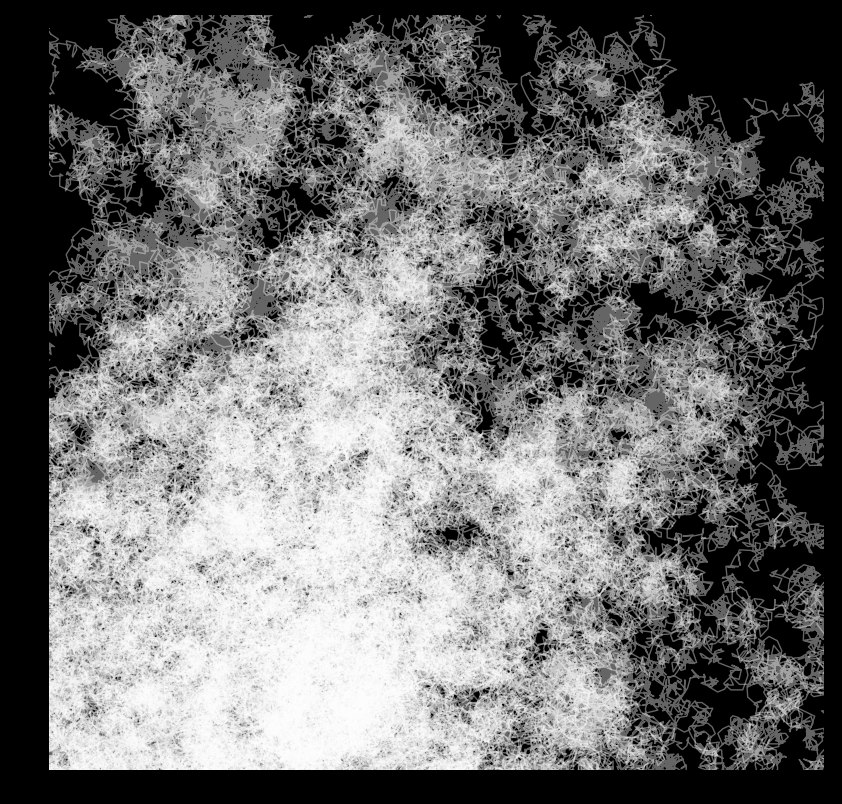
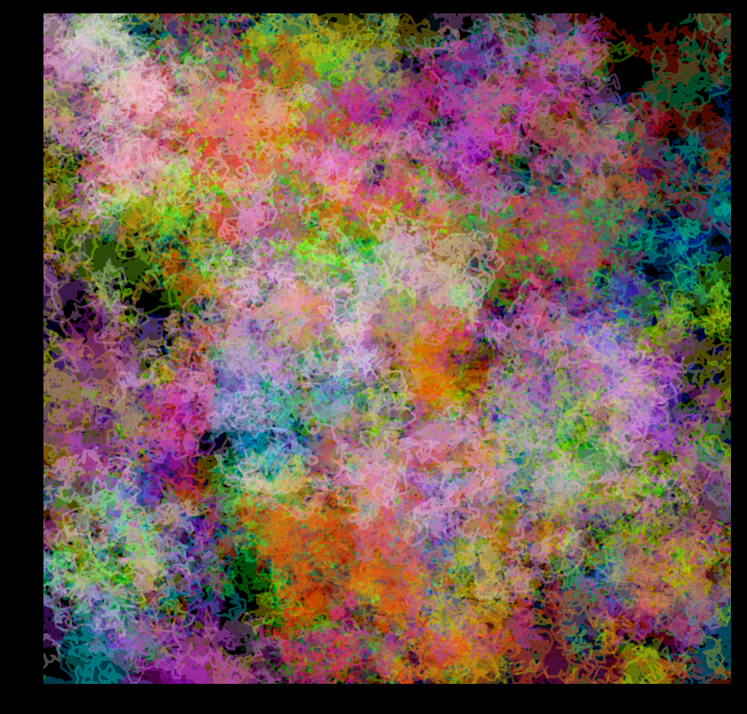

# Random walkers art

This is based on a work by Vedran Sekara (https://vedransekara.github.io/2017/11/29/random_walkers.html)

Let a whole bunch of random walkers walk around the plane 

The code is in ipython notebook. Here are a couple of examples:

